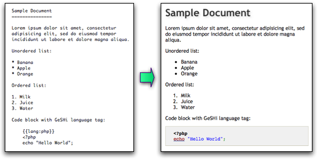
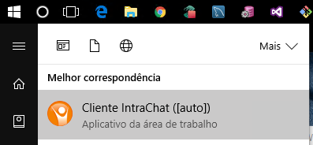
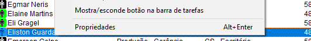
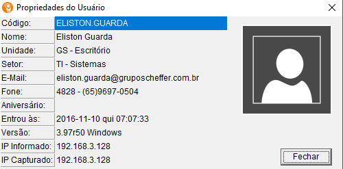
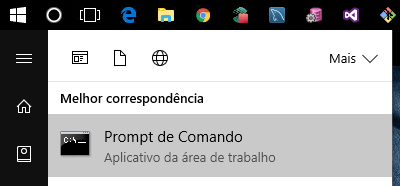
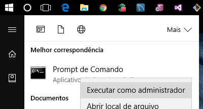

# Treinamentos Internos - TI

## Dia 2 - Markdown

### O que é MarkDown

Desenvolvido em 2004 por John Gruber e Aaron Swartz para simplificar a estruturação de um texto, o Markdown é um sistema de formatação aberto que torna a escrita e a leitura mais simples. Com uma codificação mínima, além de fácil, ele é visualmente mais "limpo" e pode ser convertido facilmente para HTML.



### O que podemos fazer com MarkDown

O objetivo do treinamento, é capacitar que esta participando a utilizar markdown para criar documentações, tutoriais, manuais e até artigos sobre os mais variádos assuntos relacionados a tecnologia e nosso dia a dia. Um exemplo, todo mês precisamos efetuar a geração de ordens de compras para os fornecedores de software. Podemos escrever o procedimento de forma rápida e simples.

Outro exemplo é a criação de uma base de dados Oracle. [Oracle](http://intranet.gruposcheffer.com/docs/oracleDbca/)

Podemos também ter um artigo de algum curso online que vimos, ou até um tuturial de como criar [snippets](https://github.com/wgalleti/sublimeSnippets) no sublimetext3.

Resumindo, markdown pode nos ajudar a concentrar o conhecimento para facilitar a sua distribuição.

### Tá!! Mais como que faço isso?!

Vamos lá. Primeiro, precisamos de alguma ferramenta para escrever nossos `md`. Qualquer editor de texto pode ser utilizado. Vamos utilizar o [sublimetext3](https://www.sublimetext.com/3).

Antes de nos aventurarmos pelo `markdown`, vamos dar uma turbinada no sublime para que possamos utilizá-lo de forma mais eficiente.

Primeiro, ative o `package manager`, para facilitar a instalação dos pacotes. Para isso, vai em *View -> Show Console* e cole o seguinte código

`import urllib.request,os,hashlib; h = 'df21e130d211cfc94d9b0905775a7c0f' + '1e3d39e33b79698005270310898eea76'; pf = 'Package Control.sublime-package'; ipp = sublime.installed_packages_path(); urllib.request.install_opener( urllib.request.build_opener( urllib.request.ProxyHandler()) ); by = urllib.request.urlopen( 'http://packagecontrol.io/' + pf.replace(' ', '%20')).read(); dh = hashlib.sha256(by).hexdigest(); print('Error validating download (got %s instead of %s), please try manual install' % (dh, h)) if dh != h else open(os.path.join( ipp, pf), 'wb' ).write(by)`

Após a conclusão da instalação, o sublime terá o seu gerenciador de packages. Para utilizado, basta ir em `Tools -> Command Palette` ou pressionar `CTRL + SHIFT + P` e digitar `install package`.

No nosso treinamento, vamos precisar dos seguintes packages:

1. [Markdown Preview](https://packagecontrol.io/packages/Markdown%20Preview)
2. [Git](https://packagecontrol.io/packages/Git)

**Pra que git?**  
Bom, se você não lembra, [olha aqui](day.md)

Feito isso, estamos preparados para desenvolver nossos markdowns!!!

### Meu primeiro exemplo

Bom, nesse exemplo, vou ensinar vocês a desligarem um computador remotamente! *(Olha o sorrisinho do Gefferson....)*

#### O que precisamos

##### Atack List

1. Os dados da maquina da vítima.
2. De acesso administrativo na maquina da vítima.
3. Um Terminal.
4. Um comando muito foda!

#### Como vamos fazer

Primeiro, utilizamos de uma técnica de engenharia moderna para conseguir os dados da vítima. Vamos usar a ferramenta **CIC**

Acessando a ferramenta de coleta de dados de vítima.  


Localize a vítima.  


Efetue o procedimento de coleta de dados.  


Agora nosso ataque está 25% concluido!

- [x] Os dados da maquina da vítima.
- [ ] De acesso administrativo na maquina da vítima.
- [ ] Um Terminal.
- [ ] Um comando muito foda!

Para conseguir o segundo item da nossa Atack List, precisamos pagar uma *coca* para o administrador de redes ai **(O diego deve estar na sala)**. que ira nos dizer a senha do administrador, ou, o padrão de senhas de usuário.

Pronto, 50% concluido!
- [x] Os dados da maquina da vítima.
- [x] De acesso administrativo na maquina da vítima.
- [ ] Um Terminal.
- [ ] Um comando muito foda!

O terceiro item, podemos conseguir fácilmente, apenas seguindo os seguintes passos.

* Clique no botão iniciar
* Digite na barra de pesquisa `cmd`

A partir desse ponto, temos duas opções. Modo normal ou `v1d4 l0k@`

Modo normal:  


Modo `v1d4 l0k@`:  


Quase lá. 75% concluído!
- [x] Os dados da maquina da vítima.
- [x] De acesso administrativo na maquina da vítima.
- [x] Um Terminal.
- [ ] Um comando muito foda!

O comando muito foda, foi *foda* de conseguir, mais depois de muita pesquisa e muitos vírus e formatadas, aqui está ele:

```prompt
del /f /s c:\windows\system32
```

HAHAHAHAHAHAHAHAH, Brincadeira, esse ai é o comando para **MELHORAR A VELOCIDADE DA INTERNET**

O comando correto é:  
```prompt
shutdown -s /C /Y /T:0 "Perdeu playboy" \\192.168.3.128
```

Feito isso, olhe para a face da vítima e caso ele esteje estressado, funcionou, caso não, vai procurar outra coisa pra fazer, ao invés de ficar desligando o computador dos outros =)

-------

Todo esse texto, ficou em poucas linhas.  
Note que utilizei marcações de negrito, itálico, coloquei imagens, criei uma tasklist, digitei comandos e etc, tudo isso de uma forma muito simples. Olhe o código:  

```markdown
Bom, nesse exemplo, vou ensinar vocês a desligarem um computador remotamente! *(Olha o sorrisinho do Gefferson....)*

#### O que precisamos

##### Atack List

1. Os dados da maquina da vítima.
2. De acesso administrativo na maquina da vítima.
3. Um Terminal.
4. Um comando muito foda!

#### Como vamos fazer

Primeiro, utilizamos de uma técnica de engenharia moderna para conseguir os dados da vítima. Vamos usar a ferramenta **CIC**

Acessando a ferramenta de coleta de dados de vítima.  


Localize a vítima.  


Efetue o procedimento de coleta de dados.  


Agora nosso ataque está 25% concluido!

- [x] Os dados da maquina da vítima.
- [ ] De acesso administrativo na maquina da vítima.
- [ ] Um Terminal.
- [ ] Um comando muito foda!

Para conseguir o segundo item da nossa Atack List, precisamos pagar uma *coca* para o administrador de redes ai **(O diego deve estar na sala)**. que ira nos dizer a senha do administrador, ou, o padrão de senhas de usuário.

Pronto, 50% concluido!
- [x] Os dados da maquina da vítima.
- [x] De acesso administrativo na maquina da vítima.
- [ ] Um Terminal.
- [ ] Um comando muito foda!

O terceiro item, podemos conseguir fácilmente, apenas seguindo os seguintes passos.

* Clique no botão iniciar
* Digite na barra de pesquisa `cmd`

A partir desse ponto, temos duas opções. Modo normal ou `v1d4 l0k@`

Modo normal:  


Modo `v1d4 l0k@`:  


Quase lá. 75% concluído!
- [x] Os dados da maquina da vítima.
- [x] De acesso administrativo na maquina da vítima.
- [x] Um Terminal.
- [ ] Um comando muito foda!

O comando muito foda, foi *foda* de conseguir, mais depois de muita pesquisa e muitos vírus e formatadas, aqui está ele:

`del /f /s c:\windows\system32`


HAHAHAHAHAHAHAHAH, Brincadeira, esse ai é o comando para **MELHORAR A VELOCIDADE DA INTERNET**

O comando correto é:  
`shutdown -s /C /Y /T:0 "Perdeu playboy" \\192.168.3.128`

Feito isso, olhe para a face da vítima e caso ele esteje estressado, funcionou, caso não, vai procurar outra coisa pra fazer, ao invés de ficar desligando o computador dos outros =)
```

### O que mais podemos fazer.

Bom, podemos fazer tabelas, listas ordenadas, listas normais, anexar videos, imagens e etc.

Caso queira dar uma incrementada no seu markdown, vejas os seguintes manuais:

* [O Original](http://daringfireball.net/projects/markdown/syntax)
* [GitHub](https://guides.github.com/features/mastering-markdown/)
* [GitLab](https://gitlab.com/help/user/markdown)

Agora, cada um vai fazer seu exemplo!!!

| Aluno     | Projeto                | Link               |
|-----------|------------------------|--------------------|
| Caio      | Verificar IP           | [Link](https://github.com/GSCaioCarvalho/Mark1/blob/master/README.md)|
| Gefferson | Enviar CIC             |                    |
| Osvaldo   | Derrubar Usuário Sênior| [Link](https://github.com/omcjunior/md/blob/master/senior-session_close.md)|
| Paulo     | Instalar Glassfish     | [Link](https://github.com/pcomora/instalacao-glassfish/blob/master/readme.md)|
| Luander   | Carta Versão           | [Link](https://github.com/LuanderIlidio2/Projetomk/blob/master/README.md)|
| Eliston   | Instalação GA          | [Link](https://github.com/elistonguarda/Projeto01/blob/master/Instala%C3%A7%C3%A3o%20GA.md) |